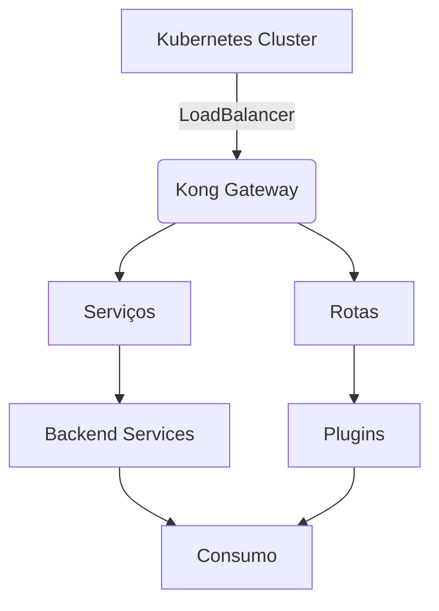

# Kong API Gateway - Kubernetes Deployment

## ✅ Status: Rodando com Sucesso!

Kong API Gateway deployado no Kubernetes com PostgreSQL e painel administrativo.

## Acessos - Mesmo Domínio, Portas Diferentes

### URLs Principais
- **Proxy HTTP**: http://kong.archse.eng.br
- **Proxy HTTPS**: https://kong.archse.eng.br
- **Admin UI**: https://kong.archse.eng.br/admin
- **Admin API**: https://kong.archse.eng.br/kong-admin

### Portas Diretas (LoadBalancer)
- **Proxy**: kong.archse.eng.br:80 (HTTP) / :443 (HTTPS)
- **Admin API**: kong.archse.eng.br:8001
- **Manager UI**: kong.archse.eng.br:8002

### Credenciais
- **Username**: admin
- **Password**: Kong@2024
- **Admin Token**: admin-secret-token-2024

## Arquitetura de Acesso



## Deploy do Painel Admin

Escolha uma das opções:

### Kong Manager (Nativo)
```bash
kubectl apply -f k8s/kong-manager.yaml
```

### Kong Admin UI
```bash
kubectl apply -f k8s/kongadmin-deployment.yaml
```

## Verificação

```bash
# Verificar pods
kubectl get pods -n kong

# Acessar painel
https://admin.kong.archse.eng.br
```

## Recursos

### Kong Gateway
- CPU: 250m (request) / 1000m (limit)
- Memory: 512Mi (request) / 1Gi (limit)
- Portas: 8000, 8001, 8002, 8443, 8444, 8445

### Kong Admin UI
- CPU: 50m (request) / 100m (limit)
- Memory: 64Mi (request) / 128Mi (limit)

## Próximos Passos

1. Acesse o painel admin
2. Configure serviços e rotas pela UI
3. Adicione plugins (rate-limiting, CORS, auth)
4. Configure consumidores e credenciais
5. Monitore tráfego e logs